# Entity Reference — SSA Web Application

> **Generated:** February 2026
> **Package root:** `net.superiorstate.ams.model`
> **Persistence:** EclipseLink JPA, `ssaPU`, MySQL `beta_ssa`
> **Inheritance strategy:** `SINGLE_TABLE` (rooted at `Assignee`)

## Business Context

Superior State Administers (SSA) is a benefits administration company that uses **DataPath Inc.'s Summit** as its primary cloud-based administration system. Summit is the day-to-day platform for administering FSA, HRA, ICHRA, Transit, and COBRA services for SSA's clients.

**This web application (beta_ssa) bridges** the data SSA encounters across its operations with the source-of-truth data held in Summit for active clients. Key data flows:

- **Employers** = SSA's clients (imported from Summit)
- **Employees** = benefit participants or potential participants (imported from Summit)
- **Benefits** = the various services SSA administers: FSA, HRA, MERP, ICHRA, EBHRA, QSEHRA, COBRA, Transit, Retiree Billing, Direct Billing, Lifestyle Savings Account

### Important Design Decisions

1. **Person vs. Employee:** Summit's employee tables don't cover everyone SSA interacts with. The `Person` table was created so that every Employee can be linked to a Person, but not every Person is an Employee. A Person could be: a spouse, a new prospect, a sales agent, an employer contact, etc.

2. **Benefit ID Convention (CDH vs. Premium Billing):** Summit maintains two separate benefit tables — Consumer Driven Health (CDH) benefits and Premium Billing benefits (COBRA, Direct Bill, Retiree Billing). During import, both are brought into the single `Benefit` table. Since their IDs could overlap, **Premium Billing benefit IDs are negated** (positive → negative Long) to ensure uniqueness.

3. **Legacy Summit entities (`s`-prefix):** The entities in `model/summit/imports/` with `s` prefixes (`sEmployer`, `sEmployee`, `sBenefit`, `sBenefitYear`, `sEnrollment`) are **legacy and largely replaced** by the `Import*` entities in `model/summit/imports/order/`. However, some billing entities (`BillingLink`, `Enrollment`) still hold FK references to the `s`-prefix entities, so they can't be deleted without a migration.

4. **Sales entities are underdeveloped:** Entities in `model/sales/` (Agency, Prospect, Proposal, Rate, Application, etc.) were created for the sales side of the business but have seen little active development and are seldom referenced in servlets or DAOs.

---

## Table of Contents

1. [Inheritance Hierarchy](#inheritance-hierarchy)
2. [model/general — Core Identity](#modelgeneral--core-identity)
3. [model/activity — Activity System](#modelactivity--activity-system)
4. [model/activity/note — Notes & Email](#modelactivitynote--notes--email)
5. [model/activity/renewal — Renewals](#modelactivityrenewal--renewals)
6. [model/activity/ticket — Tickets & Setup](#modelactivityticket--tickets--setup)
7. [model/activity/checklist — Checklists & Tasks](#modelactivitychecklist--checklists--tasks)
8. [model/activity/checklist/sequences — Task Sequences](#modelactivitychecklistsequences--task-sequences)
9. [model/activity/checklist/sequences/support — Sequence Support](#modelactivitychecklistsequencessupport--sequence-support)
10. [model/billing — Monthly Billing](#modelbilling--monthly-billing)
11. [model/sales/agency — Agencies & Proposals](#modelsalesagency--agencies--proposals)
12. [model/sales/offering — Service Catalog](#modelsalesoffering--service-catalog)
13. [model/sales/application — Applications](#modelsalesapplication--applications)
14. [model/summit/archive — Employer/Employee Archive](#modelsummitarchive--employeremployee-archive)
15. [model/summit/imports — Summit Import (Live)](#modelsummitimports--summit-import-live)
16. [model/summit/imports/order — Import Staging Tables](#modelsummitimportsorder--import-staging-tables)
17. [model/summit/temp — Temp/Transactional](#modelsummittemp--temptransactional)
18. [model (root) — View-Backed DTOs & Constants](#model-root--view-backed-dtos--constants)
19. [Non-Entity Support Classes](#non-entity-support-classes)
20. [Join Tables (No Entity Class)](#join-tables-no-entity-class)
21. [Entity Relationship Diagram](#entity-relationship-diagram)

---

## Inheritance Hierarchy

The entire activity/identity system shares a single table via `@Inheritance(strategy = InheritanceType.SINGLE_TABLE)` rooted at `Assignee`:

```
Assignee (abstract, @Entity, SINGLE_TABLE)
├── Person
├── PSP
├── Recipient
└── Activity
    ├── CheckList
    ├── Renewal
    ├── Ticket
    └── Setup

TaskSequence (abstract, @Entity, SINGLE_TABLE)
├── RequiredTaskList
├── RecurringTaskList
└── HowToList
```

All `Assignee` subtypes share the same database table with a discriminator column. `TaskSequence` subtypes similarly share a single table.

---

## model/general — Core Identity

### Assignee
| | |
|---|---|
| **Class** | `Assignee` (abstract) |
| **Table** | `assignee` (single-table inheritance root) |
| **ID** | `id` (Long, `@GeneratedValue`) |
| **Key Fields** | `fullName` (varchar) |
| **Relationships** | `webLinkList` → M:N WebLink (join: `assignee_links`), `assigneeContactList` → M:N Person (join: `assignee_contacts`) |
| **Notes** | Root of all identity/activity entities. Uses `SINGLE_TABLE` inheritance. |

### Person
| | |
|---|---|
| **Class** | `Person extends Assignee` |
| **Key Fields** | `firstName`, `lastName`, `middleInit`, `email`, `phone`, `title` |
| **Relationships** | `address` → 1:1 Address, `psp` → M:1 PSP, `employee` → 1:1 Employee, `emailList` → M:N Email (join: `email_recipents`), `listOfAgenciesWithThisAgent` → M:N Agency (mapped by `agentList`), `prospectList` → 1:M Prospect, `setupList` → M:N Setup (mapped by `contactList`), `listOfAssigneesWithThePerson` → M:N Assignee (mapped by `assigneeContactList`) |
| **Notes** | Universal contact record. Covers everyone SSA interacts with — employees, spouses, prospects, sales agents, employer contacts. Every Employee is a Person but not every Person is an Employee. |

### PSP
| | |
|---|---|
| **Class** | `PSP extends Assignee` |
| **Key Fields** | `taxId` (varchar 10) |
| **Relationships** | `address` → 1:1 Address, `contact` → 1:1 Person, `employer` → 1:1 Employer |
| **Named Queries** | `PSP.getById` |

### Recipient
| | |
|---|---|
| **Class** | `Recipient extends Assignee` |
| **Key Fields** | `emailAddress` |
| **Notes** | Used for non-Person email recipients. |

### User
| | |
|---|---|
| **Class** | `User` (standalone entity) |
| **Table** | `user` |
| **ID** | `person` (Person, `@OneToOne`, column `person_id`) — composite PK using Person |
| **Key Fields** | `userName` (unique), `email` (unique), `emailVerified`, `passwordHash`, `salt`, `tempGuid`, `guidExpiration`, `guidUsed`, `allowSetPassword` |
| **Relationships** | `person` → 1:1 Person, `userRoleList` → M:N UserRole (join: `userinroles`) |

### UserRole
| | |
|---|---|
| **Class** | `UserRole` |
| **Key Fields** | `id`, `description` |
| **Notes** | Lookup table for role assignments (PSP Admin, Agent, etc.) |

### Address
| | |
|---|---|
| **Class** | `Address` |
| **Key Fields** | `id`, `address1`, `address2`, `city`, `state`, `zipCode` |

### WebLink
| | |
|---|---|
| **Class** | `WebLink` |
| **Table** | `weblink` |
| **ID** | `id` (Long, column `link_id`) |
| **Key Fields** | `plainText` (description, varchar 200), `linkPath` (varchar 2000), `active` |
| **Relationships** | `linkType` → M:1 LinkType, `email` → M:1 Email, `listOfTasksWithThisWebLink` → M:N Task (mapped by `webLinkList`), `listOfAssigneesWithThisWebLink` → M:N Assignee (mapped by `webLinkList`) |

### LinkType
| | |
|---|---|
| **Class** | `LinkType` |
| **Key Fields** | `id`, `typeName` |
| **Notes** | Type 1 = file upload, Type 2 = external URL |

### TimeStretch
| | |
|---|---|
| **Class** | `TimeStretch` |
| **Notes** | Referenced in `SessionVar` for time tracking history. |

---

## model/activity — Activity System

### Activity
| | |
|---|---|
| **Class** | `Activity extends Assignee` |
| **Key Fields** | `dateCreated` (Timestamp, auto), `dueDate`, `isComplete`, `dateCompleted` |
| **Relationships** | `loggedBy` → M:1 Person (`created_by_id`), `assignedTo` → M:1 Assignee (`assigned_to_id`), `completedBy` → M:1 Person (`completed_by_id`), `primaryContact` → M:1 Person (`primary_contact`), `noteList` → 1:M Note |
| **Notes** | Base class for all activity types. Inherits `id`, `fullName`, `webLinkList`, `assigneeContactList` from Assignee. |

### ActivityOut
| | |
|---|---|
| **Class** | `ActivityOut` |
| **Notes** | DTO (non-entity) wrapping Activity for display purposes. |

### ActivityShell
| | |
|---|---|
| **Class** | `ActivityShell` |
| **Notes** | Lightweight DTO for activity list views. |

---

## model/activity/note — Notes & Email

### Note
| | |
|---|---|
| **Class** | `Note` |
| **ID** | `id` (Long) |
| **Key Fields** | `detail` (text), `dateGenerated` |
| **Relationships** | `activity` → M:1 Activity, `createdBy` → M:1 Person, `reasonCreated` → M:1 ReasonCreated, `status` → M:1 ActivityStatus |

### Email
| | |
|---|---|
| **Class** | `Email extends Note` |
| **Key Fields** | `subject` |
| **Relationships** | `recipientList` → M:N Person (mapped by `emailList`), `webLinkList` → 1:M WebLink |

### ReasonCreated
| | |
|---|---|
| **Class** | `ReasonCreated` |
| **Key Fields** | `id`, `description`, `isOutbound` |
| **Notes** | Lookup: Received Call, Received Email, Made Call, Left Voicemail, Sent Email, Quick Action, etc. |

### ActivityStatus
| | |
|---|---|
| **Class** | `ActivityStatus` |
| **Key Fields** | `id`, `description` |
| **Notes** | Lookup: 1=Waiting on Them, 2=No Change, 3=Waiting on Us |

---

## model/activity/renewal — Renewals

### Renewal
| | |
|---|---|
| **Class** | `Renewal extends Activity` |
| **Relationships** | `employer` → M:1 Employer (`employer_id`), `renewalItemList` → 1:M RenewalItem, `checkList` → 1:1 CheckList (`checklist_id`) |

### RenewalItem
| | |
|---|---|
| **Class** | `RenewalItem` |
| **Key Fields** | `id` |
| **Relationships** | `renewal` → M:1 Renewal, `benefit` → M:1 Benefit |

### RenewalEmployer
| | |
|---|---|
| **Class** | `RenewalEmployer` |
| **Notes** | DTO used for employer renewal list views. |

---

## model/activity/ticket — Tickets & Setup

### Ticket
| | |
|---|---|
| **Class** | `Ticket extends Activity` |
| **Key Fields** | `description` |
| **Relationships** | `contact` → M:1 Person (`person_id`), `ticketSubCategory` → M:1 TicketSubCategory (`ticket_category`), `contactMethod` → M:1 ContactMethod (`method_id`), `checkList` → 1:1 CheckList (`checklist_id`) |

### Setup (model/activity/ticket/setup/)
| | |
|---|---|
| **Class** | `Setup extends Activity` |
| **Relationships** | `application` → 1:1 Application, `checkList` → 1:1 CheckList, `contactList` → M:N Person, `primaryContactSetup` → M:1 Person |
| **Notes** | Represents new client setup activities. |

### TicketCategory
| | |
|---|---|
| **Class** | `TicketCategory` |
| **Key Fields** | `id` (Long), `description`, `shortCode` |
| **Notes** | Top-level categories: HOW, WHY, GET, LAW, etc. |

### TicketSubCategory
| | |
|---|---|
| **Class** | `TicketSubCategory` |
| **ID** | `id` (Long, column `subcategory_id`) |
| **Key Fields** | `description`, `isActive` |
| **Relationships** | `ticketCategory` → M:1 TicketCategory (`category_id`), `templatePurpose` → 1:1 TemplatePurpose (`temp_purpose_id`) |

### ContactMethod
| | |
|---|---|
| **Class** | `ContactMethod` |
| **Key Fields** | `id`, `description` |

### tEmployee
| | |
|---|---|
| **Class** | `tEmployee` |
| **Notes** | Ticket-specific employee view/wrapper used in `AmsDataGlobal`. |

---

## model/activity/checklist — Checklists & Tasks

### CheckList
| | |
|---|---|
| **Class** | `CheckList extends Activity` |
| **Relationships** | `toDoList` → 1:M ToDo, `recurringTaskList` → M:1 RecurringTaskList (`recurring_list_id`), `setup` → 1:1 Setup (mapped by `checkList`), `renewal` → 1:1 Renewal (mapped by `checkList`), `ticket` → 1:1 Ticket (mapped by `checkList`) |
| **Notes** | Every Activity type (Ticket, Renewal, Setup) gets an associated CheckList. |

### CheckListOut
| | |
|---|---|
| **Class** | `CheckListOut` |
| **Notes** | DTO for checklist display. |

### CheckListShell
| | |
|---|---|
| **Class** | `CheckListShell` |
| **Notes** | Lightweight DTO for checklist list views. |

### RecurringItems
| | |
|---|---|
| **Class** | `RecurringItems` |
| **ID** | `id` (Long, column `recurring_id`) |
| **Key Fields** | `isInactive`, `daysInAdvance`, `dateOne`, `dateTwo`, `dateStart` |
| **Relationships** | `assignee` → M:1 Assignee, `taskSequence` → M:1 TaskSequence (`sequence_id`), `taskFrequency` → M:1 TaskFrequency (`frequency_id`), `doWList` → M:N DoW (join: `recurring_days`) |

### model/activity/checklist/tasks/

#### Task
| | |
|---|---|
| **Class** | `Task` |
| **Key Fields** | `id` (Long), `description` |
| **Relationships** | `webLinkList` → M:N WebLink |
| **Notes** | Reusable task definitions. Task 153 = default auto-complete task. |

#### ToDo
| | |
|---|---|
| **Class** | `ToDo` |
| **Key Fields** | `id`, `sortOrder`, `isComplete` |
| **Relationships** | `checkList` → M:1 CheckList, `task` → M:1 Task |

#### ToDoOut
| | |
|---|---|
| **Class** | `ToDoOut` / `ToDoOut25` |
| **Notes** | Display DTO for todo items with state logic (blocked, delegated, etc.) |

#### SortedTask
| | |
|---|---|
| **Class** | `SortedTask` |
| **Key Fields** | `task` (Task), `sortOrder` (int) |
| **Notes** | Non-entity helper for ordering tasks during checklist creation. |

---

## model/activity/checklist/sequences — Task Sequences

### TaskSequence
| | |
|---|---|
| **Class** | `TaskSequence` (abstract, `@Entity`, SINGLE_TABLE inheritance) |
| **ID** | `id` (Long) |
| **Key Fields** | `description` |
| **Relationships** | `taskSequenceTableList` → 1:M TaskSequenceTable |
| **Notes** | Base for all task sequence types. |

### RequiredTaskList
| | |
|---|---|
| **Class** | `RequiredTaskList extends TaskSequence` |
| **Relationships** | `templatePurpose` → 1:1 TemplatePurpose (`purpose_id`) |
| **Notes** | Links a TemplatePurpose to a set of required tasks. Used for Setup and Ticket checklists. |

### RecurringTaskList
| | |
|---|---|
| **Class** | `RecurringTaskList extends TaskSequence` |
| **Relationships** | `assignee` → M:1 Person (`user_id`), `taskFrequency` → M:1 TaskFrequency, `checkLists` → 1:M CheckList (mapped by `recurringTaskList`), `doWList` → M:N DoW (join: `days_of_week`) |
| **Key Fields** | `daysInAdvance`, `dateStart` |

### HowToList
| | |
|---|---|
| **Class** | `HowToList extends TaskSequence` |
| **Key Fields** | `uniqueId` |

---

## model/activity/checklist/sequences/support — Sequence Support

### TaskSequenceTable
| | |
|---|---|
| **Class** | `TaskSequenceTable` |
| **Relationships** | `taskSequence` → M:1 TaskSequence, `task` → M:1 Task |
| **Key Fields** | `sortOrder` |
| **Notes** | Join entity linking TaskSequence to Task with ordering. |

### TemplatePurpose
| | |
|---|---|
| **Class** | `TemplatePurpose` |
| **Key Fields** | `id` (int), `description`, `sortOrder` |
| **Relationships** | `templateGroup` → M:1 TemplateGroup |
| **Notes** | Defines specific service purposes (Health FSA, HRA, COBRA, HSA, Transit, POP, etc.) tied to both billing groups and task templates. |

### TemplateGroup
| | |
|---|---|
| **Class** | `TemplateGroup` |
| **Key Fields** | `id` (int), `description` |
| **Notes** | Groups: 1=Renewal, 2=Setup, 3=Ticket |

### TaskFrequency
| | |
|---|---|
| **Class** | `TaskFrequency` |
| **Key Fields** | `id` (int), `description` |
| **Notes** | Lookup: Daily, Weekly, Bi-Weekly, Monthly, various "first/last X of the month" patterns. |

### DoW (Day of Week)
| | |
|---|---|
| **Class** | `DoW` |
| **Key Fields** | `id`, `weekdayId`, `name` |
| **Relationships** | `recurringTaskListList` → M:N RecurringTaskList (mapped by `doWList`) |

---

## model/billing — Monthly Billing

### BillingMonth
| | |
|---|---|
| **Class** | `BillingMonth` |
| **Key Fields** | `monthId` (int), `fullDate` (Date) |
| **Notes** | Each month gets a billing cycle record. |

### BillingGroup
| | |
|---|---|
| **Class** | `BillingGroup` |
| **Key Fields** | `id` (int), `description` |
| **Notes** | Groups: FSA, HRA, COBRA, HSA, Transit, POP, MERP, LSA, Other, DUAL |

### BillingGrid
| | |
|---|---|
| **Class** | `BillingGrid` |
| **ID** | `gridId` (String, composite key: `date-eeId`) |
| **Key Fields** | `currentStatus`, boolean flags: `flexSpend`, `healthReimb`, `dualPlan`, `cobra`, `transit`, `hsa`, `lsa`, `retiree`, `direct` |
| **Relationships** | `employer` → M:1 Employer, `employee` → M:1 Employee, `billingMonth` → M:1 BillingMonth |

### BillingItem
| | |
|---|---|
| **Class** | `BillingItem` |
| **ID** | `billingId` (String) |
| **Key Fields** | `employerId`, `participantId`, `benefitGroupId`, `employerName`, `participantName`, `benefitGroup`, `haveCards` |
| **Relationships** | `billingMonth` → M:1 BillingMonth |

### BillingLink
| | |
|---|---|
| **Class** | `BillingLink` |
| **ID** | `billingId` (String) |
| **Key Fields** | `uniqueId` |
| **Relationships** | `billingMonth` → M:1 BillingMonth, `sEmployer` → M:1 sEmployer (`organization_id`), `employer` → M:1 Employer |
| **Notes** | Links Summit organizations to local Employer records for billing. |

### BillingSummary ⚡ VIEW-BACKED
| | |
|---|---|
| **Class** | `BillingSummary` |
| **Table** | `billing_summary` (DB view) |
| **Annotations** | `@ReadOnly` (EclipseLink) |
| **ID** | `uuid` (String) |
| **Key Fields** | totals for: cobra, direct, dualPlan, fsa, hra, lsa, hsa, retiree, transit |
| **Relationships** | `employer` → M:1 Employer, `billingMonth` → M:1 BillingMonth |
| **Notes** | READ-ONLY. Do not persist. |

### EmployerVariance
| | |
|---|---|
| **Class** | `EmployerVariance` |
| **Notes** | Non-entity DTO for billing variance comparison between months. |

---

## model/sales/agency — Agencies & Proposals ⚠️ UNDERDEVELOPED

These entities were created for the sales workflow but have seen **little active development**. They are seldom referenced in servlets or DAOs. Included here for completeness.

### Agency
| | |
|---|---|
| **Class** | `Agency` |
| **ID** | `id` (Long, column `agency_id`) |
| **Key Fields** | `name` (varchar 200), `taxId`, `phone` |
| **Relationships** | `psp` → M:1 PSP, `address` → 1:1 Address, `primaryContact` → 1:1 Person (`contact_id`), `agencyRateList` → M:N Rate (join: `agencyrates`), `agentList` → M:N Person (join: `agents`) |

### Prospect
| | |
|---|---|
| **Class** | `Prospect` |
| **ID** | `id` (Long, column `prospect_id`) |
| **Key Fields** | `name` (varchar 200) |
| **Relationships** | `contact` → 1:1 Person, `address` → 1:1 Address, `agent` → M:1 Person (`agent_id`), `proposalList` → 1:M Proposal |

### Proposal
| | |
|---|---|
| **Class** | `Proposal` |
| **ID** | `id` (Long, column `proposal_id`) |
| **Key Fields** | `dateCreated` (Timestamp, auto), `isInactive`, `applicationGUID` (varchar 36) |
| **Relationships** | `prospect` → M:1 Prospect, `rate` → M:1 Rate, `losList` → M:N LOS (join: `proposalitems`), `application` → 1:1 Application (mapped by `proposal`) |

### Rate
| | |
|---|---|
| **Class** | `Rate` |
| **Key Fields** | `id`, `description`, `isSuppressed` |
| **Relationships** | `psp` → M:1 PSP |

### RateTable
| | |
|---|---|
| **Class** | `RateTable` |
| **ID** | `@EmbeddedId` RateTableID (composite: rate_id, price_item_id, module_id) |
| **Key Fields** | `price` (double) |
| **Relationships** | `rate` → M:1 Rate, `priceItem` → M:1 PriceItem, `module` → M:1 ServiceModule |

### RateTableID
| | |
|---|---|
| **Class** | `RateTableID` (`@Embeddable`) |
| **Key Fields** | `rateId`, `priceItemId`, `moduleId` |

### PriceItem
| | |
|---|---|
| **Class** | `PriceItem` |
| **Key Fields** | `id`, `description` |
| **Relationships** | `psp` → M:1 PSP |

### ServiceItem
| | |
|---|---|
| **Class** | `ServiceItem` |
| **Key Fields** | `id`, `description` |
| **Relationships** | `psp` → M:1 PSP |

---

## model/sales/offering — Service Catalog ⚠️ UNDERDEVELOPED

Part of the sales workflow. Defines the services SSA offers and how they're grouped into Lines of Service. Seldom referenced in active code.

### LOS (Line of Service)
| | |
|---|---|
| **Class** | `LOS` |
| **ID** | `id` (Long, column `los_id`) |
| **Key Fields** | `description` (varchar 100), `shortText` (varchar 10) |
| **Relationships** | `psp` → M:1 PSP, `serviceModuleList` → M:N ServiceModule (join: `losmodules`), `listOfProposalsThatIncludeThisLOS` → M:N Proposal (mapped by `losList`) |
| **Named Queries** | `LOS.getByPsp`, `LOS.getById` |
| **Notes** | Lines: POP, FSA, HRA/MERP, HSA, COBRA, TRANSIT |

### ServiceModule
| | |
|---|---|
| **Class** | `ServiceModule` |
| **Key Fields** | `id`, `description`, `shortText`, `sortOrder` |
| **Relationships** | `psp` → M:1 PSP, `listOfLosWithThisModule` → M:N LOS (mapped by `serviceModuleList`) |
| **Notes** | Modules: POP, FSA, Other, HRA, HSA, Payment, Cards, Doc's, COBRA, Discounts, Transit, Notes |

---

## model/sales/application — Applications ⚠️ UNDERDEVELOPED

Part of the sales workflow. Links Proposals to Application forms and their selected service modules. Setup activities reference Applications but the sales pipeline itself is seldom used.

### Application
| | |
|---|---|
| **Class** | `Application` |
| **Key Fields** | `id` |
| **Relationships** | `proposal` → 1:1 Proposal, `applicationModuleList` → 1:M ApplicationModule |

### ApplicationModule
| | |
|---|---|
| **Class** | `ApplicationModule` |
| **ID** | `@EmbeddedId` ApplicationModuleID (composite: application_id, template_purpose_id) |
| **Relationships** | `application` → M:1 Application, `templatePurpose` → M:1 TemplatePurpose |

### ApplicationModuleID
| | |
|---|---|
| **Class** | `ApplicationModuleID` (`@Embeddable`) |
| **Key Fields** | `applicationId`, `templatePurposeId` |

---

## model/summit/archive — Employer/Employee/Benefit Archive

These are the **local source-of-truth tables** that mirror Summit data. They are populated and kept in sync by the import pipeline (`Importer` → staging tables → `Updater` → archive).

### Employer
| | |
|---|---|
| **Class** | `Employer` |
| **ID** | `id` (int, column `employer_id`) — **not auto-generated** (matches Summit's Organization ID) |
| **Key Fields** | `employerName`, `email`, `contactName`, `phone`, `erKey`, `altId`, `isActive`, `isBillable`, boolean flags: `hasPop`, `hasPb`, `hasCdh` |
| **Relationships** | `contactList` → M:N Employee |
| **Notes** | Each Employer = one of SSA's clients. Synced from Summit via ImportEmployer staging table. |

### Employee
| | |
|---|---|
| **Class** | `Employee` |
| **ID** | `id` (int, column `employee_id`) — **not auto-generated** |
| **Key Fields** | `firstName`, `lastName`, `mmKey`, `email`, `hrEmail`, address fields, `userId`, `isActive`, `customId`, `eeStatusId`, `systemStatusId`, `cobraStatusId` |
| **Relationships** | `employer` → M:1 Employer (`employer_id`), `employerList` → M:N Employer (mapped by `contactList`) |
| **Notes** | Represents a benefit participant or potential participant from Summit. Negative IDs = HSA-only employees (not in Summit). Every Employee can be linked to a Person, but not every Person is an Employee. |

### Benefit
| | |
|---|---|
| **Class** | `Benefit` |
| **ID** | `id` (int, column `benefit_id`) |
| **Key Fields** | `planName`, `planDescription`, `effectiveDate`, `terminationDate`, `isActive`, `hasCards`, `lastRenewed`, `nextRenewalDue`, `pbBenId` |
| **Relationships** | `employer` → M:1 Employer, `planType` → M:1 PlanType, `renewalItemList` → 1:M RenewalItem |
| **Notes** | Unified benefit table combining Summit's CDH and Premium Billing exports. **Positive IDs** = CDH benefits (FSA, HRA, HSA, etc.). **Negative IDs** = Premium Billing benefits (COBRA, Direct Bill, Retiree Billing) — negated during import to prevent ID collision. Services administered: FSA, HRA, MERP, ICHRA, EBHRA, QSEHRA, COBRA, Transit, Retiree Billing, Direct Billing, LSA. |

### PlanType
| | |
|---|---|
| **Class** | `PlanType` |
| **ID** | `planTypeId` (int, column `PlanType_ID`) |
| **Key Fields** | `code`, `planTypeName` |
| **Relationships** | `billingGroup` → M:1 BillingGroup, `templatePurpose` → M:1 TemplatePurpose (`purpose_id`) |
| **Notes** | Maps Summit's plan type codes to billing groups and template purposes. CDH types: DCA, FSA, HRA, HSA, LFSA, MERP, PRA, ICHRA, EBHRA, DRiP, LSA. Premium Billing types: PRK, TRN, Dental, EAP, Life, Medical, Pharmacy, Vision, NEFSA. |

### CoverageStatus
| | |
|---|---|
| **Class** | `CoverageStatus` |
| **ID** | `id` (String, column `coverage_status_id`) |
| **Key Fields** | `monthFor`, `isActive`, `hasCards` |
| **Relationships** | `employer` → M:1 Employer, `employee` → M:1 Employee, `benefit` → M:1 Benefit, `billingGroup` → M:1 BillingGroup |

---

## model/summit/imports — Summit Import (Live) ⚠️ LEGACY

These `s`-prefix entities were the **original** mappings to Summit's live data. They have been **largely replaced** by the `Import*` staging entities in `model/summit/imports/order/`. However, they cannot be deleted yet because the following entities still hold FK references to them:

- `BillingLink` → references `sEmployer`
- `Enrollment` (in `model/summit/temp/`) → references `sEmployee`, `sEmployer`, `sBenefit`, `sBenefitYear`
- `sEnrollment` → references `sEmployee`, `sBenefitYear`

**Future cleanup:** These dependencies should be migrated to use `Import*` entities or the archive tables, after which the `s`-prefix entities can be removed.

### sEmployer
| | |
|---|---|
| **Class** | `sEmployer` |
| **ID** | `organizationId` (int) |
| **Key Fields** | Various Summit employer fields |
| **Notes** | Summit's representation of an employer/organization. |

### sEmployee
| | |
|---|---|
| **Class** | `sEmployee` |
| **ID** | `id` (int, column `Participant_ID`) |
| **Key Fields** | `firstName`, `lastName`, `dpiSuiteMmKey`, `email`, `userStatus`, address fields |
| **Relationships** | `sEmployer` → M:1 sEmployer (`Organization_ID`) |

### sBenefit
| | |
|---|---|
| **Class** | `sBenefit` |
| **ID** | `benefitId` (int, column `EmployerPlan_ID`) |
| **Key Fields** | `planName`, `planDescription`, `effectiveDate`, `terminationDate`, `planStatus`, `cardEnabled` |
| **Relationships** | `sEmployer` → M:1 sEmployer (`OrganizationID`), `PlanType` → M:1 PlanType (`PlanTypeID`) |

### sBenefitYear
| | |
|---|---|
| **Class** | `sBenefitYear` |
| **Notes** | Summit benefit year (plan year) data. |

### HsaAccount
| | |
|---|---|
| **Class** | `HsaAccount` |
| **Key Fields** | `hsaId` (int), `firstName`, `lastName`, `employer` (String name), `active` |
| **Notes** | Raw HSA account data imported from custodian files. |

### HsaEe
| | |
|---|---|
| **Class** | `HsaEe` |
| **ID** | `hsaId` (int, column `hsa_id`) |
| **Key Fields** | `firstName`, `lastName`, address fields, `phone` |
| **Relationships** | `hsaEr` → M:1 HsaEr (`hsa_er_id`), `employee` → 1:1 Employee (`employee_id`) |

### HsaEr
| | |
|---|---|
| **Class** | `HsaEr` |
| **ID** | `name` (String — employer name as PK) |
| **Key Fields** | `billedDirect` |
| **Relationships** | `employer` → 1:1 Employer (`organization_id`) |

---

## model/summit/imports/order — Import Staging Tables (from Summit Exports)

These entities are populated from **Summit's export functionality** — CSV/Excel files exported from DataPath Summit and uploaded into beta_ssa. They serve as staging tables that the `Updater` service then uses to sync data into the archive tables (`Employer`, `Employee`, `Benefit`).

**Import pipeline:** Summit Export → CSV files → `Importer` service → staging tables → `Updater` service → archive tables

**Benefit ID convention:** `ImportBenefitCdh` (import4) holds CDH benefits with positive IDs. `ImportBenefitPb` (import7) holds Premium Billing benefits (COBRA, Direct Bill, Retiree). During sync to the `Benefit` archive table, Premium Billing IDs are **negated** to prevent overlap with CDH IDs.

| Entity | Table | ID Column | Key FK |
|--------|-------|-----------|--------|
| `ImportEmployer` | `import1employer` | `OrganizationID` (int) | — |
| `ImportEmployee` | `import2employee` | `Participant_ID` (int) | → ImportEmployer (`Organization_ID`) |
| `ImportEmployeeAlt` | `import3employeealt` | `Participant_ID` (int) | → ImportEmployer (`Organization_ID`) |
| `ImportBenefitCdh` | `import4benefitcdh` | `EmployerPlan_ID` (int) | → ImportEmployer (`OrganizationID`), → PlanType (`PlanTypeID`) |
| `ImportBenefitYear` | `import5benefityear` | `EmployerPlanDetailForPlanYear_ID` (int) | → ImportBenefitCdh (`EmployerPlan_ID`) |
| `ImportEnrollment` | `import6enrollment` | `ParticipantPlan_ID` (int) | → ImportEmployee (`Participant_ID`), → ImportBenefitYear (`EmployerPlanDetailForPlanYearID`) |
| `ImportBenefitPb` | `import7benefitpb` | composite: `BenefitID` + `PlanYearID` | → ImportEmployer, → PlanType |
| `ImportBenefitTier` | (default) | composite: `EmployerID` + `PBBenefitID` + `PlanYearID` + `TierID` | → ImportEmployer, → PlanType |
| `ImportCobraQb` | `import8cobraqb` | various | → ImportEmployer |
| `ImportCobPart` | `import9cobrapart` | `Participant_id` (int) | — |

**Import Flow:** CSV upload → staging tables → `Updater` service syncs to archive tables (Employer, Employee, Benefit, etc.)

---

## model/summit/temp — Temp/Transactional

### Coverage
| | |
|---|---|
| **Class** | `Coverage` |
| **ID** | `coverageId` (int) |
| **Key Fields** | `status`, `isBillable`, `currentMonth`, `pbBenefitId`, `benefitName`, `tierName` |
| **Relationships** | `employer` → M:1 Employer (`organization_id`), `employee` → M:1 Employee (`participant_id`), `PlanType` → M:1 PlanType, `billingGroup` → M:1 BillingGroup |

### Enrollment
| | |
|---|---|
| **Class** | `Enrollment` |
| **ID** | `enrollmentId` (int) |
| **Key Fields** | `currentMonth`, `termDate`, `startDate`, `endDate`, `billable`, `employerName`, `participantName`, `benefitName`, `benefitGroup`, `cardEnabled` |
| **Relationships** | `sEmployee` → M:1 sEmployee, `sEmployer` → M:1 sEmployer, `sBenefit` → M:1 sBenefit, `sBenefitYear` → M:1 sBenefitYear, `billingGroup` → M:1 BillingGroup |

---

## model (root) — View-Backed DTOs & Constants

### Constant
| | |
|---|---|
| **Class** | `Constant` |
| **Table** | `constant` |
| **ID** | `name` (String) |
| **Key Fields** | `value`, `note` |
| **Notes** | Application configuration key-value pairs. |

### Activity25 ⚡ VIEW-BACKED
| | |
|---|---|
| **Class** | `Activity25` |
| **Notes** | View-backed read-only DTO for the main activity list. Referenced by `AmsDataGlobal`. |

### Activity25p ⚡ VIEW-BACKED
| | |
|---|---|
| **Class** | `Activity25p` |
| **Notes** | PSP-filtered variant of the activity view. |

### Activity25u ⚡ VIEW-BACKED
| | |
|---|---|
| **Class** | `Activity25u` |
| **Notes** | User-filtered variant of the activity view. Referenced by `SessionVar`. |

### Checklist25 ⚡ VIEW-BACKED
| | |
|---|---|
| **Class** | `Checklist25` |
| **Notes** | View-backed read-only DTO for checklist display. |

### EmployeeV ⚡ VIEW-BACKED
| | |
|---|---|
| **Class** | `EmployeeV` |
| **Notes** | View-backed read-only employee view. |

### PersonV ⚡ VIEW-BACKED
| | |
|---|---|
| **Class** | `PersonV` |
| **Notes** | View-backed read-only person view. |

> **⚡ VIEW-BACKED entities are READ-ONLY.** They map to MySQL views, not tables. Never call `persist()` or `merge()` on them.

---

## Non-Entity Support Classes

These are DTOs or helper classes that appear in the model layer but are **not** JPA entities:

| Class | Package | Purpose |
|-------|---------|---------|
| `ActivityOut` | `model/activity/` | Activity display wrapper |
| `ActivityShell` | `model/activity/` | Lightweight activity list item |
| `CheckListOut` | `model/activity/checklist/` | Checklist display wrapper |
| `CheckListShell` | `model/activity/checklist/` | Lightweight checklist list item |
| `ToDoOut` / `ToDoOut25` | `model/activity/checklist/tasks/` | ToDo display with state logic |
| `SortedTask` | `model/activity/checklist/tasks/` | Task + sort order pair |
| `RenewalEmployer` | `model/activity/renewal/` | Employer renewal list item |
| `EmployerVariance` | `model/billing/` | Billing variance comparison |
| `RateTableID` | `model/sales/agency/` | `@Embeddable` composite key |
| `ApplicationModuleID` | `model/sales/application/` | `@Embeddable` composite key |

---

## Join Tables (No Entity Class)

These M:N relationships are managed via `@JoinTable` — no separate entity class exists:

| Join Table | Owning Entity | Target Entity | Columns |
|------------|--------------|---------------|---------|
| `assignee_links` | Assignee | WebLink | `assignee_id`, `link_id` |
| `assignee_contacts` | Assignee | Person | `assignee_id`, `person_id` |
| `email_recipents` | Person | Email | `recipient_id`, `email_id` |
| `userinroles` | User | UserRole | `person_id`, `role_id` |
| `agents` | Agency | Person | `agency_id`, `person_id` |
| `agencyrates` | Agency | Rate | `agency_id`, `rate_id` |
| `proposalitems` | Proposal | LOS | `proposal_id`, `los_id` |
| `losmodules` | LOS | ServiceModule | `los_id`, `module_id` |
| `days_of_week` | RecurringTaskList | DoW | `item_id`, `dow_id` |
| `recurring_days` | RecurringItems | DoW | `item_id`, `dow_id` |

---

## Entity Relationship Diagram

```mermaid
erDiagram
    %% ===== CORE IDENTITY (SINGLE_TABLE) =====
    Assignee {
        Long id PK
        String fullName
    }
    Person {
        String firstName
        String lastName
        String email
        String phone
    }
    PSP {
        String taxId
    }
    Recipient {
        String emailAddress
    }
    Address {
        Long id PK
        String address1
        String city
        String state
        String zipCode
    }
    User_Entity {
        String userName
        String email
        String passwordHash
    }
    UserRole {
        int id PK
        String description
    }
    WebLink {
        Long id PK
        String plainText
        String linkPath
    }
    LinkType {
        int id PK
        String typeName
    }

    Assignee ||--o{ Person : "extends"
    Assignee ||--o{ PSP : "extends"
    Assignee ||--o{ Recipient : "extends"
    Person ||--o| Address : "has"
    Person }o--|| PSP : "belongs to"
    Person ||--o| Employee : "linked to"
    User_Entity ||--|| Person : "person_id"
    User_Entity }o--o{ UserRole : "userinroles"
    WebLink }o--|| LinkType : "type_id"

    %% ===== ACTIVITY SYSTEM =====
    Activity {
        Timestamp dateCreated
        Date dueDate
        boolean isComplete
    }
    CheckList {
        Long recurringListId
    }
    Renewal {
        Long employerId
    }
    Ticket {
        String description
    }
    Setup {
        Long applicationId
    }
    Note {
        Long id PK
        String detail
        Date dateGenerated
    }
    Email_Entity {
        String subject
    }
    ReasonCreated {
        int id PK
        String description
    }
    ActivityStatus {
        int id PK
        String description
    }

    Assignee ||--o{ Activity : "extends"
    Activity ||--o{ CheckList : "extends"
    Activity ||--o{ Renewal : "extends"
    Activity ||--o{ Ticket : "extends"
    Activity ||--o{ Setup : "extends"
    Activity }o--|| Person : "loggedBy"
    Activity }o--o| Person : "primaryContact"
    Activity }o--o| Assignee : "assignedTo"
    Activity ||--o{ Note : "noteList"
    Note ||--o{ Email_Entity : "extends"
    Note }o--|| ReasonCreated : "reasonCreated"
    Note }o--|| ActivityStatus : "status"
    Note }o--|| Person : "createdBy"
    Email_Entity }o--o{ Person : "email_recipents"

    %% ===== CHECKLIST & TASKS =====
    CheckList ||--o{ ToDo : "toDoList"
    CheckList }o--o| RecurringTaskList : "recurring_list_id"
    Ticket ||--o| CheckList : "checklist_id"
    Renewal ||--o| CheckList : "checklist_id"
    Setup ||--o| CheckList : "checklist_id"

    ToDo {
        Long id PK
        int sortOrder
        boolean isComplete
    }
    Task {
        Long id PK
        String description
    }
    ToDo }o--|| Task : "task"
    ToDo }o--|| CheckList : "checkList"

    %% ===== TASK SEQUENCES =====
    TaskSequence {
        Long id PK
        String description
    }
    RequiredTaskList {
        Long purposeId
    }
    RecurringTaskList {
        int daysInAdvance
        Date dateStart
    }
    TaskSequenceTable {
        int sortOrder
    }
    TemplatePurpose {
        int id PK
        String description
    }
    TemplateGroup {
        int id PK
        String description
    }
    TaskFrequency {
        int id PK
        String description
    }
    DoW {
        int id PK
        String name
    }

    TaskSequence ||--o{ RequiredTaskList : "extends"
    TaskSequence ||--o{ RecurringTaskList : "extends"
    TaskSequence ||--o{ TaskSequenceTable : "tables"
    TaskSequenceTable }o--|| Task : "task"
    RequiredTaskList }o--|| TemplatePurpose : "purpose_id"
    TemplatePurpose }o--|| TemplateGroup : "group"
    RecurringTaskList }o--|| TaskFrequency : "frequency"
    RecurringTaskList }o--o{ DoW : "days_of_week"
    RecurringTaskList }o--|| Person : "assignee"

    %% ===== TICKET SUPPORT =====
    TicketCategory {
        Long id PK
        String description
    }
    TicketSubCategory {
        Long id PK
        String description
    }
    ContactMethod {
        int id PK
        String description
    }

    Ticket }o--|| TicketSubCategory : "ticket_category"
    Ticket }o--|| ContactMethod : "method_id"
    Ticket }o--o| Person : "contact"
    TicketSubCategory }o--|| TicketCategory : "category_id"
    TicketSubCategory }o--o| TemplatePurpose : "temp_purpose_id"

    %% ===== RENEWALS =====
    RenewalItem {
        Long id PK
    }
    Renewal }o--|| Employer : "employer_id"
    Renewal ||--o{ RenewalItem : "items"
    RenewalItem }o--|| Benefit : "benefit"

    %% ===== SALES =====
    Agency {
        Long id PK
        String name
    }
    Prospect {
        Long id PK
        String name
    }
    Proposal {
        Long id PK
        String applicationGUID
    }
    Rate {
        Long id PK
        String description
    }
    Application_Entity {
        Long id PK
    }
    ApplicationModule {
        Long applicationId
        int templatePurposeId
    }
    LOS {
        Long id PK
        String shortText
    }
    ServiceModule {
        Long id PK
        String shortText
    }

    Agency }o--|| PSP : "psp_id"
    Agency }o--o{ Person : "agents"
    Agency }o--o{ Rate : "agencyrates"
    Prospect }o--|| Person : "agent"
    Prospect ||--o{ Proposal : "proposals"
    Proposal }o--|| Rate : "rate_id"
    Proposal }o--o{ LOS : "proposalitems"
    Proposal ||--o| Application_Entity : "application"
    Application_Entity ||--o{ ApplicationModule : "modules"
    ApplicationModule }o--|| TemplatePurpose : "template_purpose_id"
    LOS }o--o{ ServiceModule : "losmodules"
    LOS }o--|| PSP : "psp_id"
    Setup }o--|| Application_Entity : "application"

    %% ===== BILLING =====
    BillingMonth {
        int monthId PK
        Date fullDate
    }
    BillingGroup {
        int id PK
        String description
    }
    BillingGrid {
        String gridId PK
        String currentStatus
    }
    BillingLink {
        String billingId PK
    }

    BillingGrid }o--|| Employer : "employer_id"
    BillingGrid }o--|| Employee : "employee_id"
    BillingGrid }o--|| BillingMonth : "month_id"
    BillingLink }o--|| BillingMonth : "month_id"
    BillingLink }o--|| Employer : "employer_id"

    %% ===== SUMMIT ARCHIVE =====
    Employer {
        int id PK
        String employerName
        boolean isActive
    }
    Employee {
        int id PK
        String firstName
        String lastName
        int mmKey
    }
    Benefit {
        int id PK
        String planName
        Date nextRenewalDue
    }
    PlanType {
        int planTypeId PK
        String code
        String planTypeName
    }

    Employee }o--|| Employer : "employer_id"
    Benefit }o--|| Employer : "employer_id"
    Benefit }o--|| PlanType : "plan_type_id"
    PlanType }o--|| BillingGroup : "billing_group_id"
    PlanType }o--o| TemplatePurpose : "purpose_id"
    PSP }o--o| Employer : "employer_id"

    %% ===== HSA =====
    HsaEr {
        String name PK
        boolean billedDirect
    }
    HsaEe {
        int hsaId PK
        String firstName
        String lastName
    }
    HsaAccount {
        int hsaId PK
        boolean active
    }

    HsaEr }o--|| Employer : "organization_id"
    HsaEe }o--|| HsaEr : "hsa_er_id"
    HsaEe }o--o| Employee : "employee_id"

    %% ===== COVERAGE =====
    CoverageStatus {
        String id PK
        boolean isActive
    }
    CoverageStatus }o--|| Employer : "employer_id"
    CoverageStatus }o--|| Employee : "employee_id"
    CoverageStatus }o--|| Benefit : "benefit_id"
    CoverageStatus }o--|| BillingGroup : "billing_group_id"
```



---

## Quick Lookup Index

| "I need to find..." | Look at... |
|---------------------|-----------|
| What table does Person map to? | `assignee` (single-table inheritance) |
| Relationship between Ticket and CheckList? | Ticket has `@OneToOne checkList` (column `checklist_id`) |
| What are the Activity subtypes? | CheckList, Renewal, Ticket, Setup — all extend Activity which extends Assignee |
| Which entities are read-only views? | Activity25, Activity25p, Activity25u, Checklist25, EmployeeV, PersonV, BillingSummary |
| Where do Summit CSV imports go? | `model/summit/imports/order/` — tables `import1employer` through `import9cobrapart` |
| Why are some Benefit IDs negative? | Premium Billing benefits (COBRA, Direct Bill, Retiree) have IDs negated to avoid collision with CDH benefit IDs |
| What links Summit to local data? | `Updater` service syncs Import staging tables → archive tables (Employer, Employee, Benefit) |
| What's the task template chain? | TemplateGroup → TemplatePurpose → RequiredTaskList → TaskSequenceTable → Task |
| How does billing work? | BillingMonth → BillingGrid (per employee per month) with boolean flags per service type |
| What's the difference between Person and Employee? | Every Employee is a Person, but Person also covers spouses, prospects, agents, contacts — anyone SSA interacts with |
| What are the `s`-prefix entities? | Legacy Summit mappings (`sEmployer`, `sEmployee`, etc.) — largely replaced by `Import*` entities, but still referenced by some billing entities |
| Are the sales entities active? | Mostly underdeveloped — Agency, Prospect, Proposal, Rate, Application exist but are seldom used in active code |
| What is Summit? | DataPath Inc.'s cloud-based benefits administration platform — SSA's primary system for FSA, HRA, COBRA, etc. |
